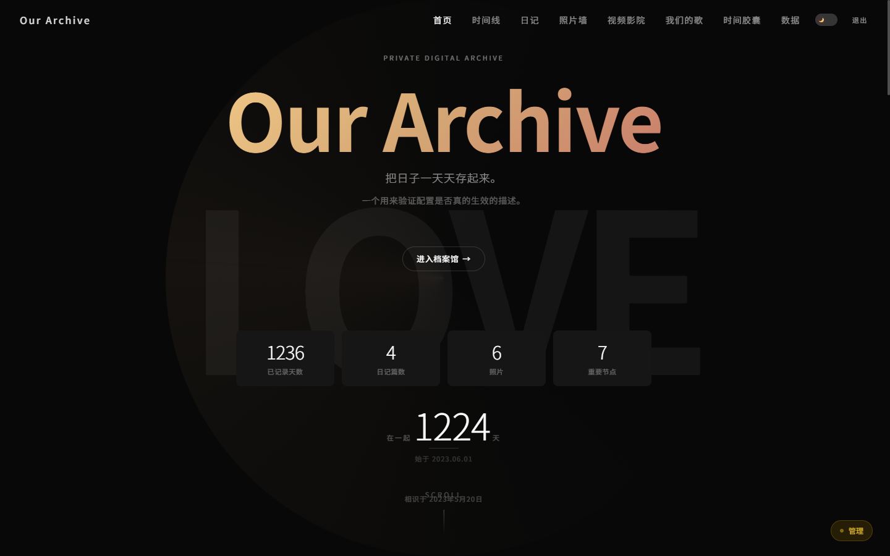
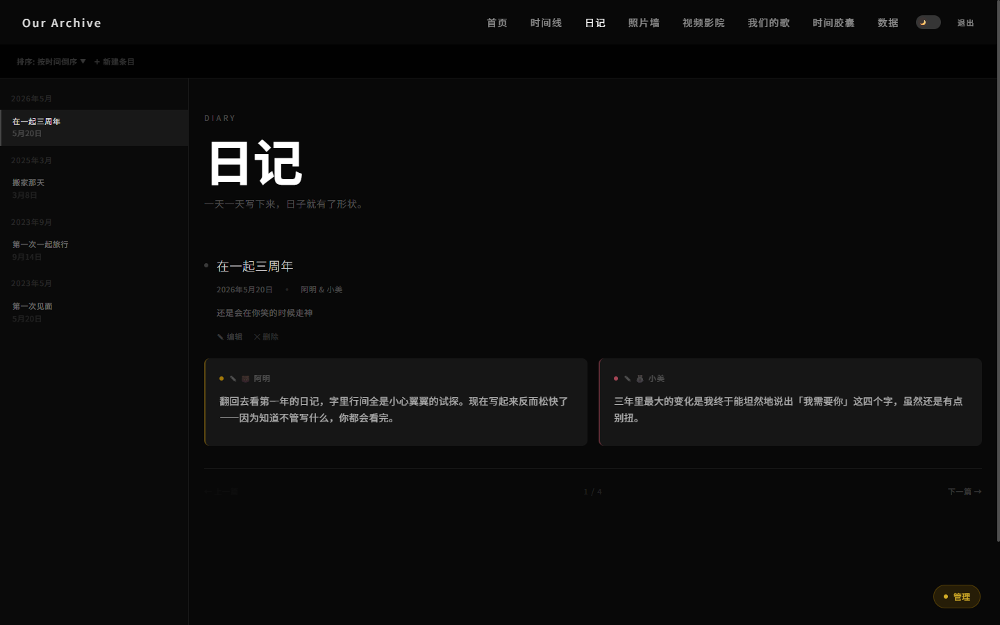
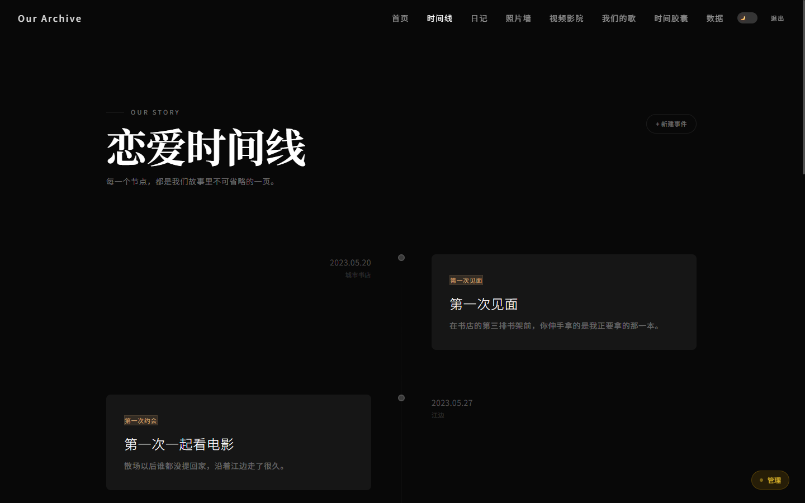
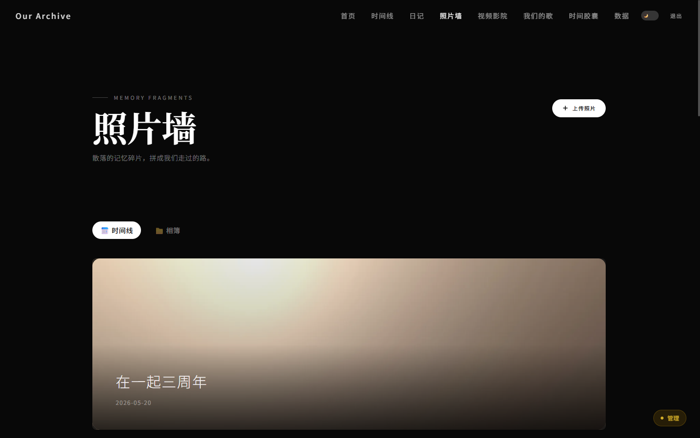
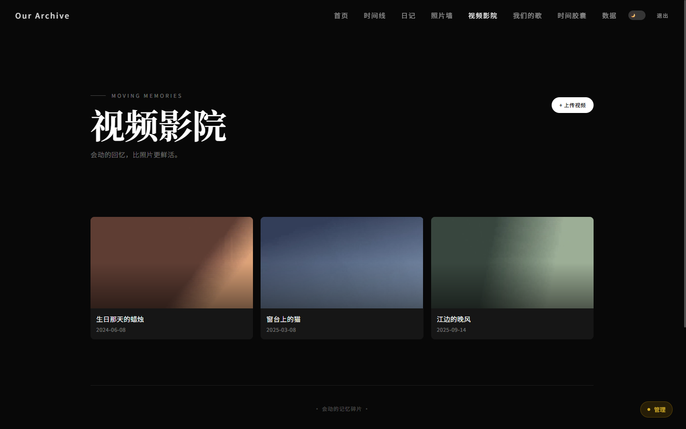
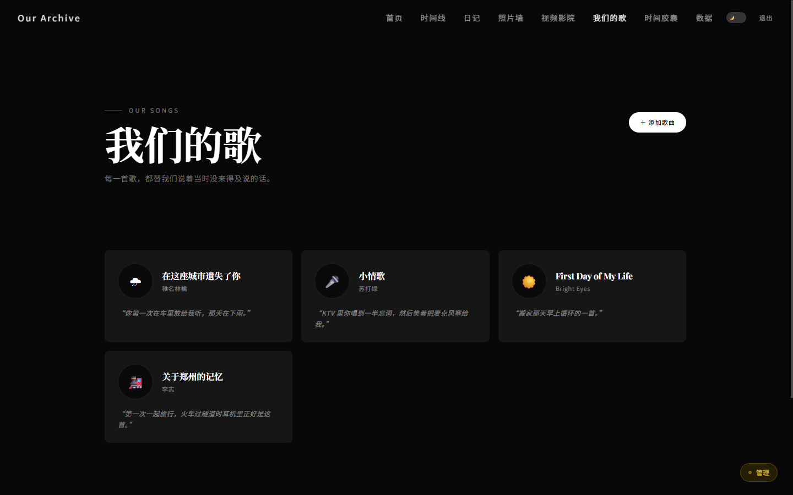
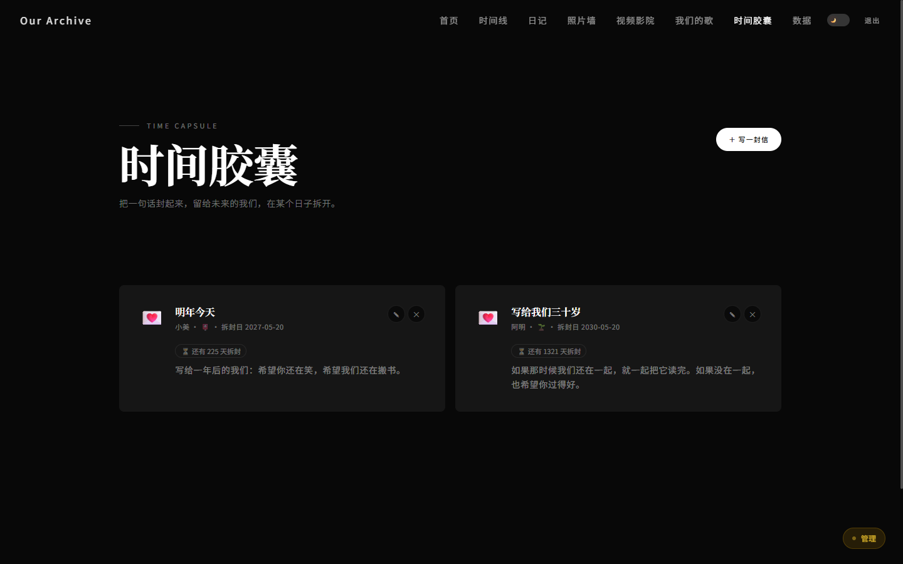
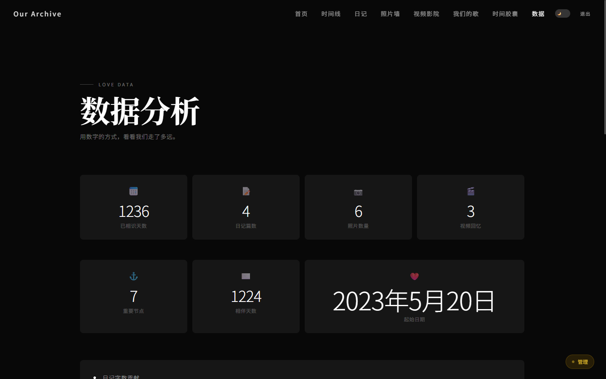
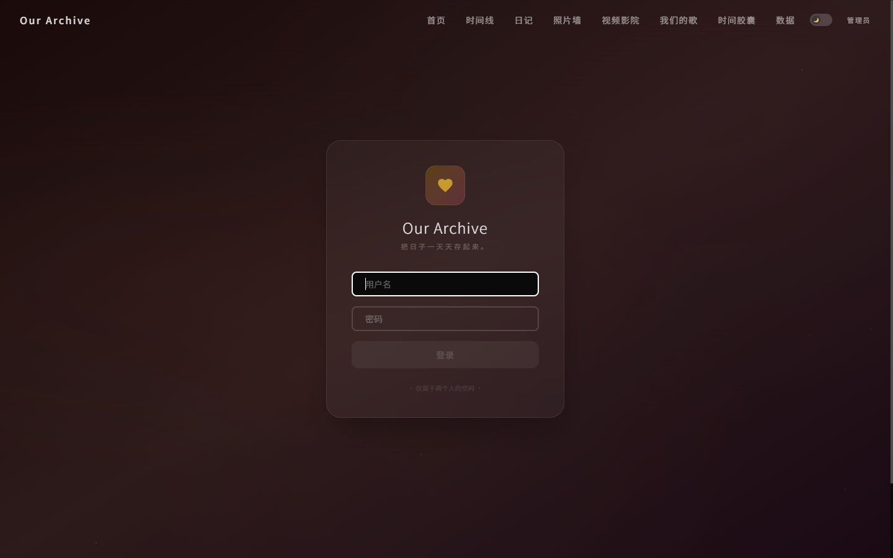

# love-archive-core

[](https://github.com/ruzhai/love-archive-core/actions/workflows/ci.yml)
[](LICENSE)

**A self-hosted archive for a relationship** — timeline, two-author diary, photo wall, videos, anniversary countdowns.
A quiet place to keep the days.

> 一个自建的恋爱 / 纪念日档案馆。时间线、双人日记、照片墙、视频、纪念日倒计时。
> **两个人的日子，都放在这里。**

---

## 它是什么

**这里放两个人的日子。**

哪一年的风，哪一夜的月亮，
第一次说那句话的时候是什么天气——
日子过得很快，快到许多瞬间还没来得及记住，就已经走远了。

所以有了这里。

同一个日子，你写一段，Ta 写一段，两段字迹并排搁着；
先落笔的那个人在左边，之后不会再变。
照片、视频、想说却没说出口的话，也都收在这里。
还可以写一封定好日期的信，锁起来，等那一天到了再一起拆。

多年以后翻回某一天，那天的字、那天的光、那天记下的一个瞬间，
会重新摆到你面前——
像一封寄了很久的信，绕过许多年，终于回到你手里。

日子一直往前走。
这里替你们，把它们留下来。

## 功能

| | 页面 | 说明 |
|---|---|---|
| 📅 | `/timeline` | 时间线。第一次聊天 / 见面 / 牵手 / 吵架 / 和好……按类型标注，可按日期排序 |
| 📖 | `/diary` | 日记。同一天两个人各写一段 Markdown，配照片，上一篇/下一篇翻页 |
| 🖼 | `/gallery` | 照片墙。时间线视图或相簿视图，拖拽排序、旋转、逐张评论、批量上传 |
| 🎬 | `/videos` | 视频影院。上传到本地，封面墙 + 播放 |
| 🎵 | `/playlist` | 歌单。写下每首歌想说的话 |
| ⏳ | `/capsules` | 时间胶囊。写一封设定解锁日期的信，到期前只显示「未拆」 |
| 📊 | `/stats` | 统计。相识天数、相伴天数、月度照片/日记数量、作者分布 |
| 🏠 | `/` | 首页。天数卡片、**那年今日**、即将到来的纪念日、最近动态 |

**那年今日**是首页的主打：它会去翻同月同日的所有历史内容——那天写过的日记、拍过的照片、
记下的节点——在多年后的同一天重新摆到你面前。

## 截图



| 日记 · 双人同日各写一段 | 时间线 |
|---|---|
|  |  |

| 照片墙 | 视频影院 |
|---|---|
|  |  |

| 我们的歌 | 时间胶囊 |
|---|---|
|  |  |

| 数据统计 | 登录 |
|---|---|
|  |  |

> 截图里的照片和视频是生成的占位图，不是真实内容——仓库里不带任何人的私人数据。

## 快速开始

### Docker（推荐）

```bash
git clone https://github.com/ruzhai/love-archive-core.git
cd love-archive-core
cp .env.example .env
```

打开 `.env`，至少填一项：

```bash
JWT_SECRET=$(openssl rand -base64 48)
```

然后：

```bash
docker compose up -d --build
```

首次启动会自动建库、建账号。**去日志里拿初始密码**：

```bash
docker compose logs app | grep -A4 "随机密码"
```

打开 `http://你的服务器:3000`，用 `author1` 和日志里那串密码登录。

也可以在 `.env` 里事先写好 `ADMIN_PASSWORDS={"author1":"...","author2":"..."}`，就不走随机密码了。

### 本地开发

```bash
npm install
cp .env.example .env   # 填 JWT_SECRET，本地调试把 SECURE_COOKIES 设成 false
npm run seed           # 建库 + 建账号
npm run dev
```

## 配置

**能改的东西都集中在 [`lib/config.ts`](lib/config.ts)**，每一项都可以用 `NEXT_PUBLIC_*` 环境变量覆盖
（见 [`.env.example`](.env.example)）。改名字、改日期、改称呼，不用碰任何组件代码。

| 变量 | 作用 |
|---|---|
| `JWT_SECRET` | **必填。** 会话签名密钥。生产环境不设会启动即失败 |
| `NEXT_PUBLIC_AUTHOR1_NAME` / `_EMOJI` | 第一位记录者的显示名和头像 emoji |
| `NEXT_PUBLIC_AUTHOR2_NAME` / `_EMOJI` | 第二位 |
| `NEXT_PUBLIC_START_DATE` | 故事起点，首页「已记录天数」从这天算 |
| `NEXT_PUBLIC_RELATIONSHIP_DATE` | 正式在一起的日子，「相伴天数」和纪念日倒数用它 |
| `NEXT_PUBLIC_SITE_NAME` / `_NAME_CN` / `_TAGLINE` / `_DESCRIPTION` | 站点标题与文案 |
| `ADMIN_PASSWORDS` | 首次建号用的密码，JSON 格式。不填则随机生成 |
| `DATABASE_PATH` | SQLite 文件位置，默认 `./love-archive.db` |
| `SECURE_COOKIES` | 上了 HTTPS 反代设 `true`；直接 http 访问必须 `false` |
| `APP_PORT` | 对外端口，默认 3000 |

> ⚠️ `NEXT_PUBLIC_*` 是**构建期**变量——Next.js 会把它们的值直接编进客户端 JS。
> Docker 下它们写在 `docker-compose.yml` 的 `build.args` 里，改完必须
> `docker compose up -d --build` 重新构建，只 `restart` 不会生效。

### 一个常见的坑

直接 `http://IP:3000` 访问时登录失败（提示密码错误、或密码对了却一直回到登录页），
几乎总是因为 `SECURE_COOKIES` 没设成 `false`——带 `Secure` 的 cookie 在 http 下会被浏览器直接丢掉。

## 数据与备份

只有两处需要备份：

```
data/       # SQLite 数据库（日记、时间线、纪念日、账号……）
uploads/    # 上传的照片和视频
```

```bash
tar czf love-archive-backup-$(date +%F).tar.gz data uploads
```

`uploads/cache/` 是自动生成的缩略图缓存，丢了会重新生成，不用备份。

## 技术栈

- **框架**：Next.js 16（App Router）+ React 19
- **样式**：Tailwind CSS v4，深色暖调设计系统
- **动画**：Framer Motion
- **数据库**：[sql.js](https://sql.js.org/)（SQLite 编译成 WASM，纯进程内）+ [Drizzle ORM](https://orm.drizzle.team/)
- **鉴权**：bcrypt 密码哈希 + `jose` 签发的 HS256 JWT，整站 middleware 鉴权墙，CSRF 双提交 cookie，登录限流 + 审计日志
- **图片**：sharp 生成多档缩略图，按需生成 + 落盘缓存

### 为什么是 sql.js 而不是 better-sqlite3

这是一个**明确的取舍**，不是随手选的：

- ✅ 纯 WASM，没有原生模块，`npm ci` 在任何平台都不会编译失败，Docker 镜像也不用装构建工具链
- ✅ 数据库整个在内存里，读路径没有任何 I/O
- ❌ 写操作是**整库导出、整文件覆盖**（防抖合并），不是行级写入。数据量大了之后每次写都是 O(全库)

换句话说：**这东西适合两个人的日记（几千条），不适合当多用户系统的后端。**
`lib/db/index.ts` 里所有写路径都走 `saveDb()`，要换成 `better-sqlite3` 只需要改这一层。

## 项目结构

```
love-archive-core/
├── app/
│   ├── page.tsx              # 首页（服务端组件，读 DB 算「那年今日」和统计）
│   ├── timeline/ diary/ gallery/ videos/ playlist/ stats/ capsules/
│   ├── login/
│   └── api/                  # 所有写操作都走 REST，客户端组件 fetch
├── components/
├── hooks/                    # 客户端数据层：useEventLibrary / usePhotoLibrary / ...
├── lib/
│   ├── config.ts             # ★ 站点身份配置，改这里
│   ├── db/                   # schema + sql.js 连接 + 首次播种
│   ├── auth/                 # JWT / 会话 / 鉴权
│   ├── thumbnails.ts         # sharp 缩略图流水线
│   └── types.ts
├── docs/screenshots/         # README 里的截图
├── docker/entrypoint.sh      # 首次启动建库
├── Dockerfile
└── docker-compose.yml
```

## 开发

```bash
npm run dev         # 开发服务器
npm run typecheck   # tsc --noEmit
npm run lint        # eslint
npm run build       # 生产构建
npm run seed        # 建库 + 建账号（幂等，不会覆盖已有账号）
```

## 路线图

- [ ] 全文搜索
- [ ] 导出为静态站点（把档案馆变成一份可以长期保存的 HTML）
- [ ] 云端备份（S3 / 对象存储）
- [ ] 年度报告
- [ ] 多阶段构建：devDependencies 现在也进了运行镜像（约 497MB），可以压下来
- [ ] 写入接口校验：`POST /api/entries` 缺 `id` 时会静默存下一行空 id，应当拒绝或由服务端补齐

## License

[MIT](LICENSE)
